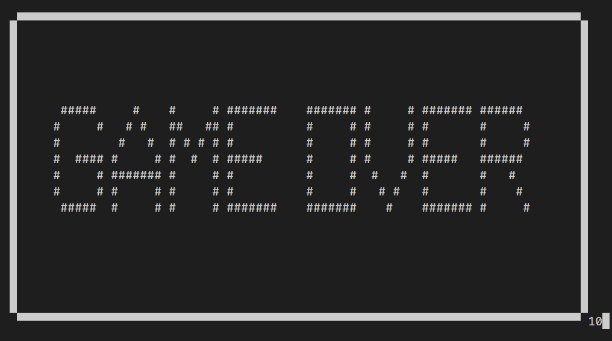

# Snake

A minimal implementation of the classic Snake game on the terminal. 

## Requirements
- numpy
- curses (win-curses for windows)
- a terminal that support unicode block characters 

Run `./src/main.py` to launch the game and press any key to start.

## Information

- Control the snake using WASD.
- Collect apples to toggle special effects
- - Increase/decrease movement speed
- - Toggle boundary walls
- Survive as long as possible without running into yourself or the walls!

## Gameplay

